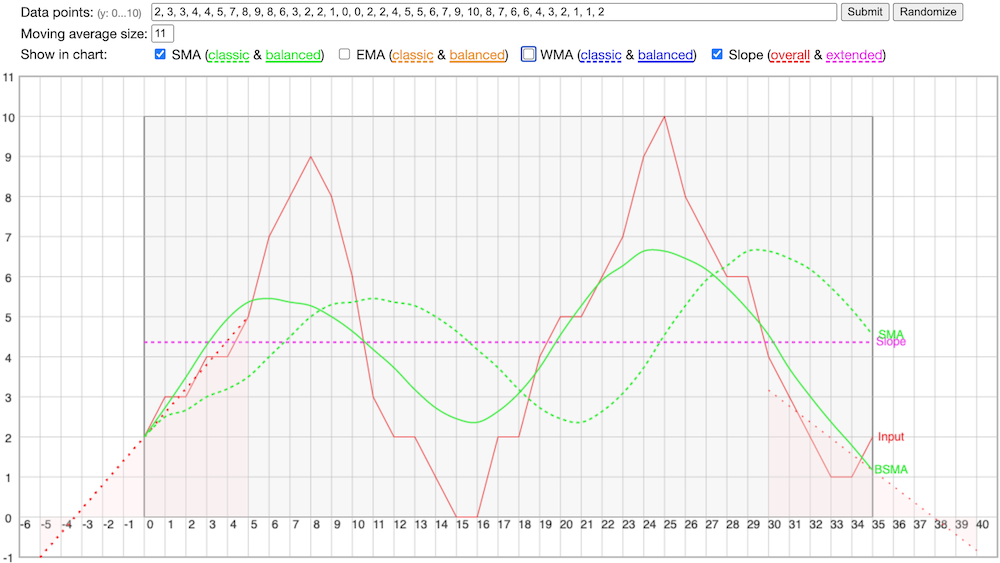

# Moving Average Code & Demo (moving-average-js, v1.0.1)

This package provides a JavaScript function to calculate an array of SMA (simple moving average), EMA (exponential moving average), and WMA (weighted moving average) of data points, using either a classic or balanced algorithm. A demo HTML page using this function is provided to try various moving average algorithms.

## Getting Started

```
  $ git clone https://github.com/peterthoeny/moving-average-js.git # or clone your own fork
```
Point your browser to `moving-average-js/demo.html`, also available online at https://peterthoeny.github.io/moving-average-js/demo.html.

Function usage example:
```
    let dataPoints = [ 2, 2, 3, 3, 4, 4, 5, 8, 9, 7, 5, 4, 4, 5, 4 ];  // y-axis values
    let type = 'SMA';  // simple moving average
    let size = 11;     // sample width
    let sma = movingAverage(dataPoints, type, size);
    // expected: [ 2, 2, 2.3, 2.5, 2.8, 3, 3.3, 3.9, 4.4, 4.7, 4.7, 4.9, 5.1, 5.3, 5.4 ]
```

## Moving Average Documentation

The `movingAverage()` function in the `moving-average.js` Javascript file returns a moving average array from an input array of data points. The function can be used in a browser, as well as in a node.js application on a server. Three types of classic moving average algorithms are implemented:
- `SMA`: Simple moving average
- `EMA`: Exponential moving average
- `WMA`: Weighted moving average

A classic moving average algorythm looks only at a moving window (sample width) of data points to the left of the current data point. Therefore, the moving average lags behind the current data point by half the sample width, e.g. the moving average curve is shifted to the right. This method is mainly used in financial applications.

In turn, a balanced moving average algorythm looks equally to the left and right of the current data point. In other words, the moving average is centered around the current data point. This is primarily used in scientific applications.

The balanced moving average algorythm in this implementation first extends the given data points array by extrapolating the data points on both sides, so that the moving average curve looks more balanced at the beginning and end. The extrapolation assumes the extended slope of the data points equal to half of the sample width, e.g. it assumes that the same average rate of increase/decrease of half the sample width happens for the extrapolated area. Try the demo to see the extended slope on the left side and right side, and to compare that to one of the balanced moving average curves.

Three types of balanced moving average algorithms are implemented:
- `BSMA`: Balanced simple moving average
- `BEMA`: Balanced exponential moving average
- `BWMA`: Balanced weighted moving average

In addition, the slope over all data points is available with this type:
- `Slope`: Linear slope over all data points

## Function movingAverage() Documentation
```
/**
 * Calculate a moving average array from an array of data points
 *
 * @param  {Array}  arr    data points (array of y-values)
 * @param  {String} type   'SMA':   simple moving average,
 *                         'BSMA':  balanced simple moving average,
 *                         'EMA':   exponential moving average,
 *                         'BEMA':  balanced exponential moving average,
 *                         'WMA':   weighted moving average,
 *                         'BWMA':  balanced weighted moving average,
 *                         'Slope': linerar slope
 *                         'BSlope': special case returning extended array with slope used in balanced algorythm
 * @param  {String} size   size of moving array slice to calculate average
 * @return {Array}  maArr  moving average array
 */
```

## Demo

The `demo.html` file demonstrates the various moving average algorythms, also available online at https://peterthoeny.github.io/moving-average-js/demo.html. Checkmark **Slope** to see the extended slope on the left side and right side.

Screenhot of demo HTML page showing the data points (red line), the extended slopes (dashed red lines), classic SMA curve (dashed green line), balanced SMA curve (solid green line), and slope (dashed purple line):



## Repository Files

- `LICENSE` - MIT license file
- `README.md` - documentation
- `package.json` - package definition
- `moving-average.js` - JavaScript file with `movingAverage()` function
- `demo.html` - HTML file to demo various moving average algorithms
- `demo.js` - JavaScript file with charting functions, used by the demo HTML file
- `screenshot.png` - Screenshot of demo

-----
- Repository: https://github.com/peterthoeny/moving-average-js
- Copyright: 2022, Peter Thoeny
