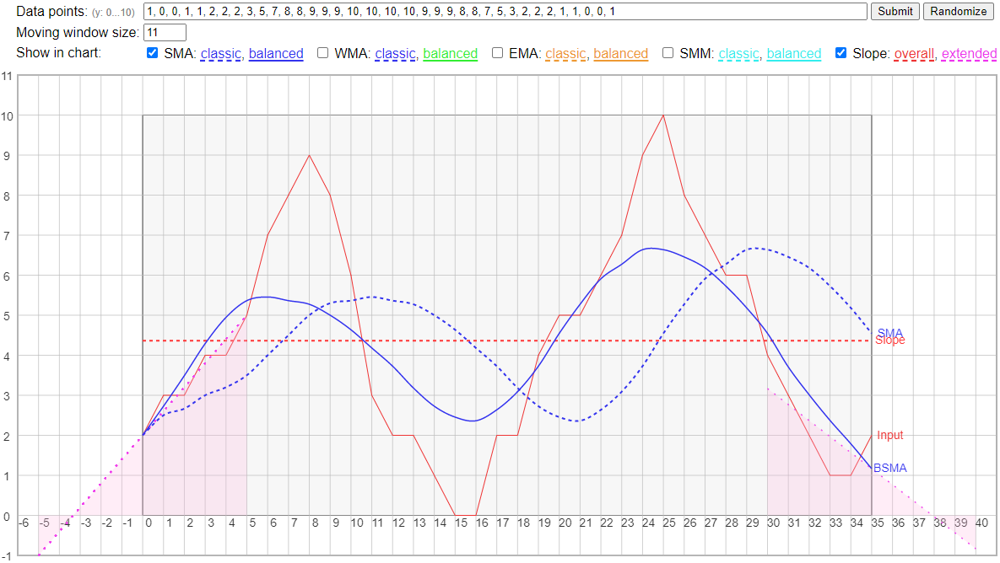

# Moving Average Code & Demo (moving-average-js, v1.1.1)

This package provides a JavaScript function to calculate an array of SMA (simple moving average), WMA (weighted moving average), and EMA (exponential moving average) of data points, using either a classic or balanced algorithm. A demo HTML page using this function is provided to try various moving average algorithms.

## Getting Started

```
  $ git clone https://github.com/peterthoeny/moving-average-js.git # or clone your own fork
```
Point your browser to `moving-average-js/demo.html`, also available online at https://peterthoeny.github.io/moving-average-js/demo.html.

Function usage example:
```
    let dataPoints = [ 2, 2, 3, 3, 4, 4, 5, 8, 9, 7, 5, 4, 4, 5, 4 ];  // y-axis values
    let type = 'SMA';  // simple moving average
    let size = 11;     // sample width
    let sma = movingAverage(dataPoints, type, size);
    // expected: [ 2, 2, 2.3, 2.5, 2.8, 3, 3.3, 3.9, 4.4, 4.7, 4.7, 4.9, 5.1, 5.3, 5.4 ]
```

## Moving Average Documentation

The `movingAverage()` function in the `moving-average.js` Javascript file returns a moving average or moving median array from an input array of data points. The function can be used in a browser, as well as in a node.js application on a server.

### Classic Moving Average Algorithms

Three types of classic moving average algorithms are implemented:
- `SMA`: [Simple moving average](https://en.wikipedia.org/wiki/Moving_average#Simple_moving_average)
- `WMA`: [Weighted moving average](https://en.wikipedia.org/wiki/Moving_average#Weighted_moving_average)
- `EMA`: [Exponential moving average](https://en.wikipedia.org/wiki/Moving_average#Exponential_moving_average)

A classic moving average algorithm looks only at a moving window (sample width) of data points to the left of the current data point. Therefore, the moving average lags behind the current data point by half the sample width, e.g. the moving average curve is shifted to the right. This method is mainly used in financial applications.

### Balanced Moving Average Algorithms

A balanced moving average, also called central moving average, or symmetrical moving average, is computed by looking equally to both sides of the current data point. In other words, the moving average is centered around the current data point. This is primarily used in scientific applications.

The balanced moving average algorithm in this implementation first extends the given data points array by extrapolating the data points on both sides, so that the moving average curve looks more balanced at the beginning and end. The extrapolation assumes that the extended slope of the data points is equal to half of the sample width, e.g. it assumes that the same average rate of change over half the sample width happens also for the extrapolated range. Try the demo to see the extended slope on the left side and right side, and to compare that to one of the balanced moving average curves.

Three types of balanced moving average algorithms are implemented:
- `BSMA`: Balanced simple moving average
- `BWMA`: Balanced weighted moving average
- `BEMA`: Balanced exponential moving average

### Moving Median Algorithms

In contrast to a moving average, a simple moving _median_ is calculated by sorting the values inside the moving window of data points, and finding the value in the middle. The moving median tolerates shocks and outlier values better than the moving mean.

A single type of moving median is currently implemented with classic and balanced algorithms:
- `SMM`: [Simple moving median](https://en.wikipedia.org/wiki/Moving_average#Moving_median)
- `BSMM`: Balanced simple moving median

### Slope Algorithm

A slope shows the average rate of change over all data points:
- `Slope`: Linear slope over all data points

## Function movingAverage() Documentation
```
/**
 * Calculate a moving average array from an array of data points
 *
 * @param  {Array}  arr    data points (array of y-values)
 * @param  {String} type   'SMA':   simple moving average,
 *                         'BSMA':  balanced simple moving average,
 *                         'WMA':   weighted moving average,
 *                         'BWMA':  balanced weighted moving average,
 *                         'EMA':   exponential moving average,
 *                         'BEMA':  balanced exponential moving average,
 *                         'SMM':   simple moving median,
 *                         'BSMM':  balanced simple moving median,
 *                         'Slope': linear slope over all data points
 * @param  {String} size   size of moving array slice to calculate average
 * @return {Array}  maArr  moving average array
 */
function movingAverage(arr, type, size) {
}
```

## Demo

The `demo.html` file demonstrates the various moving average algorithms, also available online at https://peterthoeny.github.io/moving-average-js/demo.html. The extended slopes are shown on the left side and right side when the **Slope** checkbox is checked.

Screenhot of demo HTML page showing the data points (red line), the extended slopes (dashed purple lines), classic SMA curve (dashed blue line), balanced SMA curve (solid blue line), and slope (dashed red line):



## Repository Files

- `LICENSE` - MIT license file
- `README.md` - documentation
- `package.json` - package definition
- `moving-average.js` - JavaScript file with `movingAverage()` function
- `demo.html` - HTML file to demo various moving average algorithms
- `demo.js` - JavaScript file with charting functions, used by the demo HTML file
- `screenshot.png` - Screenshot of demo

-----
- Repository: https://github.com/peterthoeny/moving-average-js
- Copyright: 2022, Peter Thoeny
